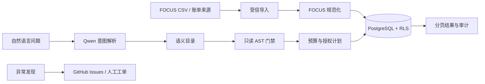

# FinOps Agent

FinOps Agent 是一个面向云成本分析和治理的 FastAPI 服务。账单先进入服务端受信存储，再经过 FOCUS 规范化、租户隔离、只读 AST 校验、预算控制和分页执行。自然语言模型只负责生成类型化查询意图，不能直接生成或执行 SQL。

项目提供离线内存/SQLite 适配器，也提供 PostgreSQL + 原生 RLS 的生产装配。两种模式的测试和 live smoke 分开记录；离线适配器通过不代表真实数据库、账单来源或工单系统已经验证。

## 项目简介与适用场景

上面的说明定义了服务适用的云成本查询和治理边界。

## 功能清单

- FOCUS 风格账单导入，保留来源 ID、水位线和原始引用。
- PostgreSQL 持久化账单、查询、结果、异常和工单记录，租户上下文通过事务级 `set_config` 注入。
- 原生 RLS 和 `FORCE ROW LEVEL SECURITY` 防止跨租户读取。
- 自然语言意图解析、语义目录版本和 AST 只读门禁。
- 预算、超时、CAS 状态推进、稳定分页和结果缓存。
- 运行取消只能作用于持久化中的 `running` 任务，已完成任务不可改写。
- UNKNOWN 副作用账本、恢复脚本和 GitHub Issues 工单适配器。
- Qwen 和 GitHub 授权缺失时明确返回 blocked，不静默使用假适配器。

## 系统架构与核心流程



生产 API 不接受客户端提交的 `rows` 作为查询数据源。该字段仅为兼容旧调用保留，服务端查询始终从受信仓储读取。

## 技术栈与运行依赖

| 分类 | 组件 |
| --- | --- |
| API | Python 3.12、FastAPI、Pydantic |
| 数据 | PostgreSQL 16、psycopg、原生 RLS；离线可选 SQLite |
| 账单 | FOCUS 规范化、来源适配器 |
| 查询 | 语义目录、只读 SQL AST、预算和分页 |
| 模型与工单 | Qwen/DashScope、GitHub Issues |
| 质量 | Pytest、Ruff、Compileall、Docker Compose |

## 目录结构说明

```text
app/finops/api.py              HTTP API、身份签名和状态装配
app/finops/persistence.py      内存、SQLite、PostgreSQL 仓储
app/finops/security/           身份解析和 RLS 计划
app/finops/focus/              FOCUS 账单规范化
app/finops/intent/             Qwen/离线意图模型
app/finops/query/              AST、预算和执行计划
app/finops/results/            结果缓存和分页
app/finops/anomaly/            异常归因
app/finops/tickets/            工单适配器和幂等
app/finops/recovery/           UNKNOWN 与恢复账本
frontend/                      Vue 3、TypeScript、Vite 成本治理控制台
migrations/finops/             PostgreSQL 表和 RLS 迁移
scripts/finops/                FOCUS 导入、live smoke、回滚
tests/                         API、契约、安全和恢复测试
compose.yaml                   PostgreSQL 与 API 集成环境
```

## 环境要求

- Python 3.12+
- Docker Desktop，用于 PostgreSQL、Keycloak、API 和前端集成环境
- Qwen 验证需要 `QWEN_API_KEY` 和 `QWEN_CHAT_MODEL`
- GitHub 工单验证需要 `GITHUB_TOKEN`、仓库名和 Issue 写权限

## 本地快速启动

离线模式：

```bash
python -m venv .venv
python -m pip install -e ".[server]"
python -m uvicorn app.finops.api:app --host 127.0.0.1 --port 8002
```

接口文档为 http://127.0.0.1:8002/docs，健康检查为 http://127.0.0.1:8002/health。

本地持久化可设置：

```powershell
New-Item -ItemType Directory -Force .\runtime | Out-Null
$env:FINOPS_DATABASE_PATH = ".\runtime\finops.db"
```

## Docker 或中间件启动方式

启动真实 PostgreSQL 和 API：

```bash
export KEYCLOAK_ADMIN_PASSWORD='replace-with-a-local-password'
docker compose -p finops-production-v1 up -d --build --wait
```

服务地址：

| 服务 | 地址 |
| --- | --- |
| API | http://127.0.0.1:8002 |
| Web 控制台 | http://127.0.0.1:3102 |
| Keycloak | http://127.0.0.1:8182 |
| PostgreSQL | `127.0.0.1:5434` |

Compose 使用 `FINOPS_IDENTITY_MODE=oidc`。后端验证 Keycloak 的签名、issuer、audience、时效、租户声明和角色；浏览器不能通过请求头自报租户。`signed` 仅保留给受信服务间调用。

停止环境：

```bash
docker compose -p finops-production-v1 down
```

## 配置项和环境变量

| 变量 | 默认值 | 用途 |
| --- | --- | --- |
| `FINOPS_BASE_URL` | 空 | live smoke 服务地址 |
| `FINOPS_DATABASE_URL` | 空 | PostgreSQL 连接串；设置后启用真实仓储 |
| `FINOPS_DATABASE_PATH` | 空 | SQLite 文件；只用于离线持久化 |
| `FINOPS_IDENTITY_MODE` | `offline` | 正式环境使用 `oidc`；`signed` 仅用于服务间调用 |
| `FINOPS_OIDC_ISSUER_URL` | 空 | Keycloak Realm issuer |
| `FINOPS_OIDC_JWKS_URL` | 空 | 容器内 JWKS 地址 |
| `FINOPS_OIDC_AUDIENCE` | 空 | Access Token 受众 |
| `KEYCLOAK_ADMIN_PASSWORD` | 必填 | 本地 Keycloak 管理密码，不得提交 |
| `QWEN_API_KEY` | 空 | Qwen 密钥，不得提交 |
| `QWEN_CHAT_MODEL` | `qwen-plus` | 文本模型 |
| `QWEN_BASE_URL` | DashScope 兼容地址 | 模型 API 地址 |
| `GITHUB_TOKEN` | 空 | GitHub Issues 授权 |
| `GITHUB_REPOSITORY` | 空 | `owner/repository` |

## 主要 API

| 方法 | 路径 | 说明 |
| --- | --- | --- |
| `GET` | `/health` | 健康检查 |
| `POST` | `/billing-ingestions` | 导入账单 |
| `GET` | `/billing-ingestions` | 查询当前租户导入结果 |
| `GET` | `/dashboard` | 成本总览 |
| `POST` | `/query-plans` | 从自然语言生成受控计划 |
| `POST` | `/query-plans/{plan_id}/execute` | 执行未过期的授权计划 |
| `GET` | `/queries` | 查询任务列表 |
| `GET` | `/findings` | 异常列表 |
| `GET` | `/tickets` | 工单列表 |
| `GET` | `/recovery-status` | UNKNOWN 对账状态 |
| `POST` | `/queries` | 创建只读查询 |
| `GET` | `/queries/{query_id}/trace` | 查询执行溯源 |
| `DELETE` | `/queries/{query_id}` | 取消运行中的查询 |
| `POST` | `/findings/{finding_id}/tickets` | 创建异常工单 |

除健康检查外，OIDC 模式请求需要 `Authorization: Bearer <token>`。租户和角色只从已验签 Token 提取。

### 导入账单

```bash
curl -X POST http://127.0.0.1:8002/billing-ingestions \
  -H "Content-Type: application/json" \
  -H "Authorization: Bearer ${ACCESS_TOKEN}" \
  -H "X-Request-Id: request-001" \
  -d '{"watermark":"2026-08-01T00:00:00Z","raw_lines":[{"source_id":"aws-line-001","currency":"USD","unit":"cost","amount":"18.75","watermark":"2026-08-01T00:00:00Z","raw_ref":"focus://billing.csv#2"}]}'
```

### 创建并执行受控查询计划

```bash
curl -X POST http://127.0.0.1:8002/query-plans \
  -H "Content-Type: application/json" \
  -H "Authorization: Bearer ${ACCESS_TOKEN}" \
  -H "X-Request-Id: request-002" \
  -d '{"question":"查看本月成本趋势","estimated_cost":"2.50","budget_limit":"100.00"}'

curl -X POST http://127.0.0.1:8002/query-plans/${PLAN_ID}/execute \
  -H "Content-Type: application/json" \
  -H "Authorization: Bearer ${ACCESS_TOKEN}" \
  -H "X-Request-Id: request-003" \
  -d '{"page_size":50}'
```

自然语言只能选择服务端维护的类型化查询模板，模型不能提交任意 SQL。兼容接口中的 `rows` 即使存在也不会作为数据源。

## 请求示例与返回结果

上面的 API 示例即为本地请求和返回合同；详细响应包含 `correlation_id`、状态和 provenance。

## 离线测试

```bash
python -m pytest -q
python -m compileall -q app tests scripts
ruff check app tests scripts
```

离线测试使用显式本地适配器，不访问 PostgreSQL、Qwen 或 GitHub。它们只验证状态机、AST、租户合同和幂等语义。

## 真实服务验证

启动 Compose 后执行：

```powershell
$env:FINOPS_BASE_URL = "http://127.0.0.1:8002"
$env:FINOPS_IDENTITY_MODE = "oidc"
$env:FINOPS_SMOKE_ACCESS_TOKEN = "第一个测试租户的短期 Access Token"
$env:FINOPS_SMOKE_OTHER_ACCESS_TOKEN = "第二个测试租户的短期 Access Token"
python .\scripts\finops\live_smoke.py --component health
python .\scripts\finops\live_smoke.py --component database
```

真实模型需要另外设置 `QWEN_API_KEY` 和 `QWEN_CHAT_MODEL`：

```powershell
python .\scripts\finops\live_smoke.py --component model
```

`database` smoke 会写入两个租户、查询真实 PostgreSQL，并确认客户端伪造 `rows` 不会出现在结果中。退出码 `0` 表示通过，`1` 表示连接后校验失败，`2` 表示缺少服务、密钥或授权。账单来源和 GitHub Issues 仍需各自独立 smoke。

浏览器 E2E 需要在 `finops` Realm 创建具有 `finops-operator` 角色的本地用户：

为两个 smoke 用户分别设置不同的 `tenant_id` 属性，才能验证 PostgreSQL RLS 和跨租户拒绝。

```powershell
$env:FINOPS_E2E_USERNAME = "本地测试用户名"
$env:FINOPS_E2E_PASSWORD = "本地测试密码"
npm --prefix frontend run test:e2e:live
```

## 常见问题与故障排查

### missing bearer token

OIDC 模式请求缺少 Access Token。确认从 `finops` Realm 登录，并通过 `Authorization: Bearer <token>` 发送短期令牌。

### OIDC 校验失败

检查 issuer、JWKS、audience、令牌时效、`tenant_id` 和 `finops-*` 角色。浏览器提交的租户头不会覆盖 Token 声明。

### 查询返回 AST violation

只允许语义目录中的 `SELECT`、白名单资源和参数化条件；删除 DDL、DML、函数调用或未知表名。

### 取消查询返回 409

只有持久化状态为 `running` 的任务可以取消。已完成、失败或已取消任务不会被改写。

### 工单 smoke blocked

确认 `GITHUB_TOKEN` 具有目标仓库 Issues 权限，并设置 `GITHUB_REPOSITORY`。缺少授权时保持 blocked，不创建假工单。

## 安全边界和生产注意事项

- 不提交 `.env`、API key、Cookie、Token、私有账单和日志。
- 生产 PostgreSQL 必须启用并强制执行 RLS，连接角色不能绕过策略。
- 查询 AST、预算、分页和结果 provenance 由服务端执行。
- 模型不能绕过 AST 直接执行 SQL，客户端 `rows` 不能替代账单仓储。
- 当前仍缺少三轮评测、压测、故障注入和公网稳定性观察，不能标记为 deployment-ready。

## License

MIT，详见 [LICENSE](LICENSE)。
